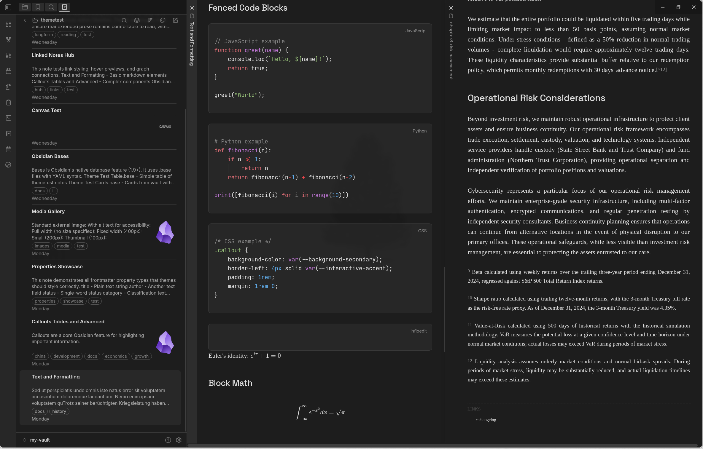

# Rationale

**A thoughtful Obsidian theme for writers, researchers, and academics.**

Rationale creates a calm, focused environment for deep work. Four carefully crafted color schemes adapt to your mood and context—from pure monochrome for distraction-free writing to warm, inviting palettes for long research sessions.

| Light | Dark |
|-------|------|
|  |  |

## Why Rationale?

Most themes optimize for aesthetics. Rationale optimizes for **the work**.

- **Serif body text** reduces eye strain during extended reading and writing
- **Clean visual hierarchy** helps you navigate complex documents
- **Monochrome icons** keep your attention on content, not chrome
- **Multiple schemes** for different contexts—focused writing, evening research, or professional presentations

## Color Schemes

Rationale includes four distinct schemes, each available in light and dark modes:

| Scheme | Character |
|--------|-----------|
| **Academic** | Monochrome—black, white, grey |
| **Anthropic** | Warm cream, terracotta accents |
| **Nordic** | Cool blue-grays, frost highlights |
| **Old Money** | Warm ivory, walnut, bronze |

Switch schemes instantly via Style Settings. Each scheme maintains consistent readability while offering a distinct atmosphere.

## Features

### Typography System

Rationale pairs fonts intentionally:

- **Body**: Source Serif 4—optimized for extended reading
- **Headings**: Space Grotesk—modern geometric sans-serif for clear hierarchy
- **Code**: JetBrains Mono—ligatures and excellent distinction from prose

All fonts are customizable. Bring your own typography via Style Settings.

### Writer-Focused Details

- **Extended checkbox states** — 20+ task statuses with monochrome outline icons (`[/]` in-progress, `[>]` deferred, `[?]` question, `[!]` important, and more)
- **Refined callouts** — scheme-aware styling that complements rather than distracts
- **Justified text option** — for that published-document feel
- **Focus mode** — hide UI elements for immersive writing
- **Cards layout** — transform dataview tables into visual grids

### Customization

Rationale integrates deeply with [Style Settings](https://github.com/mgmeyers/obsidian-style-settings):

- Color scheme selection
- Custom accent color override
- Typography (body, headings, monospace fonts)
- Layout (border radius, line width)
- Tab styling and visibility
- File explorer (icons, bold folder names)
- OLED dark mode for true blacks

### Plugin Compatibility

Tested and styled for popular plugins:

- Full Calendar
- Task Genius
- Dataview
- Calendar
- Kanban
- Notebook Navigator
- Rich Foot

## Installation

### From Community Themes (Recommended)

1. Open **Settings → Appearance → Themes**
2. Click **Manage** and search for "Rationale"
3. Click **Install and use**

### Manual Installation

1. Download `theme.css` and `manifest.json` from [releases](https://github.com/davidszp/obsidian-rationale/releases)
2. Create folder: `.obsidian/themes/Rationale/`
3. Place both files in that folder
4. Activate in **Settings → Appearance → Themes**

## Recommended Setup

1. Install the [Style Settings](https://github.com/mgmeyers/obsidian-style-settings) plugin
2. Open Style Settings and find "Rationale Theme"
3. Choose your color scheme
4. Adjust typography and layout to taste

Screenshot incorporates [Notebook Navigator](https://github.com/drbap/notebook-navigator-obsidian) and [Rich Foot](https://github.com/jparkerweb/rich-foot) plugins.

## Custom Checkboxes

Rationale supports extended task statuses with clean, monochrome outline icons:

| Syntax | Status | Syntax | Status |
|--------|--------|--------|--------|
| `[ ]` | Uncompleted | `[*]` | Star/favorite |
| `[x]` | Completed | `[l]` | Location |
| `[/]` | In progress | `[b]` | Bookmark |
| `[-]` | Cancelled | `[i]` | Information |
| `[>]` | Deferred | `[S]` | Savings |
| `[<]` | Scheduled | `[I]` | Idea |
| `[?]` | Question | `[p]` | Pro (thumbs up) |
| `[!]` | Important | `[c]` | Con (thumbs down) |
| `["]` | Quote | `[f]` | Fire/urgent |
| `[k]` | Key | `[w]` | Win |
| `[u]` | Trend up | `[d]` | Trend down |

## Contributing

Found a bug or have an idea? [Open an issue](https://github.com/davidszp/obsidian-rationale/issues).

## License

MIT License

## Acknowledgments

- [Nord](https://www.nordtheme.com/) for color inspiration (Nordic scheme)
- [Anthropic](https://www.anthropic.com/) for design language inspiration (Anthropic scheme)
- [Minimal](https://github.com/kepano/obsidian-minimal) and [Sanctum](https://github.com/jdanielmourao/obsidian-sanctum) for setting the standard in Obsidian theming
